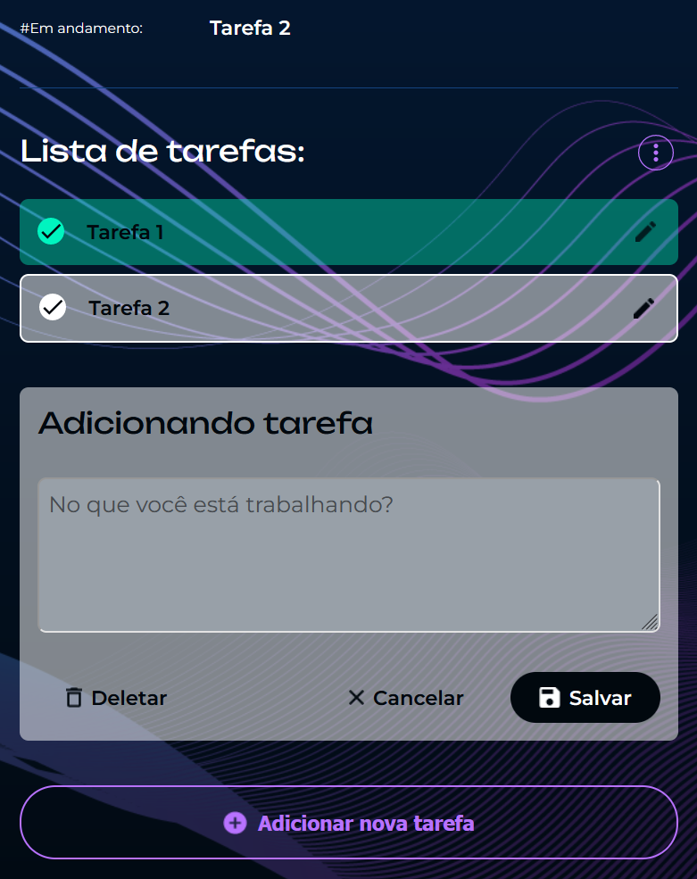

# Fokus

Projeto de temporizador para Técnica Pomodoro desenvolvido junto aos cursos JavaScript: manipulando elementos no DOM, e JavaScript na Web: armazenando dados no navegador, da Alura.

| :placard: Vitrine.Dev ||
| ------------- | --- |
| :sparkles: Nome | **Fokus**
| :label: Tecnologias | JavaScript, HTML, CSS
| :rocket: URL | https://krjorn.github.io/fokus/
| :fire: Desafio | https://cursos.alura.com.br/course/javascript-manipulando-elementos-dom
| :fire: Desafio | https://cursos.alura.com.br/course/javascript-web-dados-navegador

## Detalhes do projeto

O desenvolvimento da página foi voltado a utilização de métodos JavaScript para manipulação de DOM, onde elementos como textos, imagens e estilos são alterados de forma dinâmica. Além disso um *CRUD* foi adicionado para possibilitar que o usuário adicione e gerencie uma lista de tarefas:

